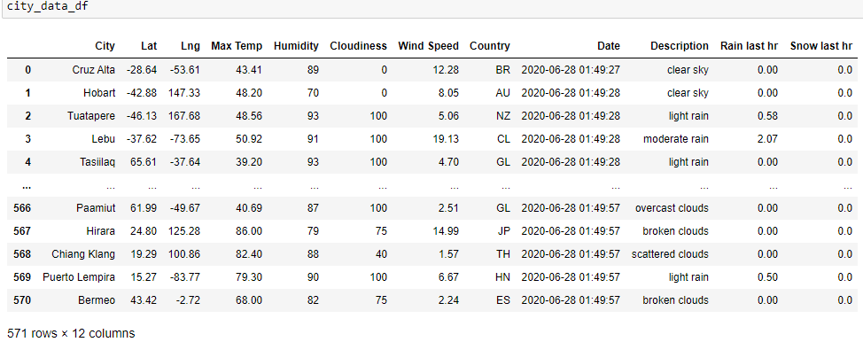
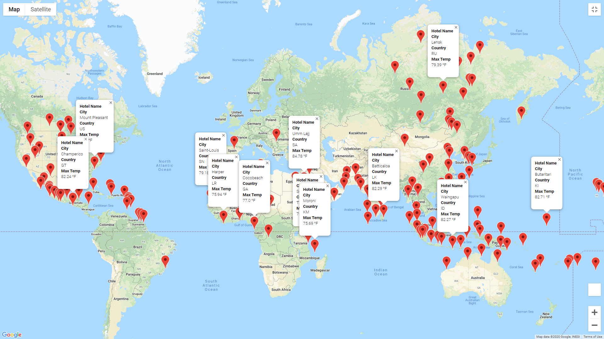
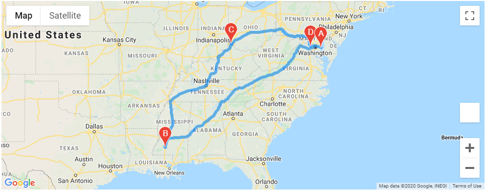
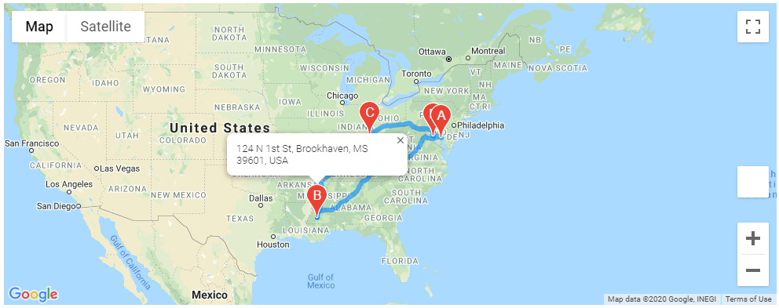

# World_Weather_Analysis

# Part 1 
## Get the Weather Description and Amount of Precipitation for Each City

Generated a random set of 1,500 latitudes and longitudes. Then used teh citipy module and OpenWaetherMap API to create a new dataframe with city and weather info. Exported to CSV for later use.

# Part 2 
## Have Customers Narrow Their Travel Searches Based on Temperature and Precipitation

Prompt the user for a temperature range & precipitation. Use this data to filter the data to a subset of vacation options. Export the new data to CSV and plot a map with markers for each city.

# Part 3 
## Create a Travel Itinerary with a Corresponding Map
Of the vacation options select (4) cities on the same continent to travel to. Generate (2) maps" 
- One with driving directions

- One with information pop-ups for each city

## Cleaned directory and organized as below
## Parts 1, 2, and 3 of the challenge
- Weather_Database.ipynb
- Vacation_Search.ipynb
- Vacation_Itinerary.ipynb

## "weather_data” folder containing the following CSV files
- WeatherPy_database.csv
- WeatherPy_vacation.csv

## “image” folder containing the images from Parts 2 and 3
- WeatherPy_vacation_map.png
- WeatherPy_travel_map.png
- WeatherPy_travel_map_markers.png